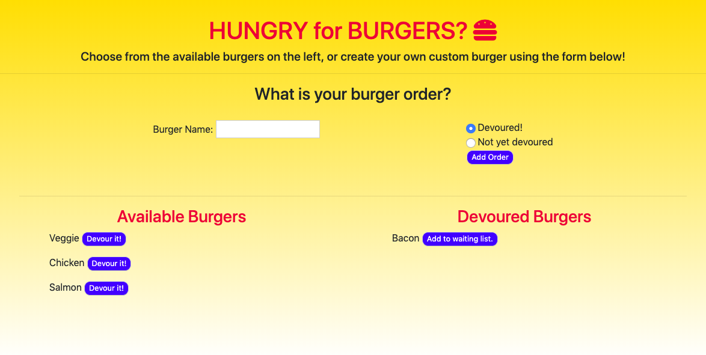

# Burger
A fun and simple app built using MySQL, Node.js, Express, and Handlebars. 

## Motivation
I created this app in order to gain experience using the technologies above while implenting the MVC strategy for structuring my code. MVC stands for Model View Controller, and it's basically a pattern that separates code into three distinct sections. While the app seems simple and easy to use, it was actually quite challenging to make! Separating the code out as client-side code and server-side code using MVC was a difficult task, and I've explained a little more about the structure below.

## Process
I first created the structure/frame for my code.
```
.
├── config
│   ├── connection.js
│   └── orm.js
│ 
├── controllers
│   └── burgers_controller.js
│
├── db
│   ├── schema.sql
│   └── seeds.sql
│
├── models
│   └── burger.js
│ 
├── node_modules
│ 
├── package.json
│
├── public
│   └── assets
│       ├── css
│       │   └── burger_style.css
│       └── img
│           └── burger.png
│   
│
├── server.js
│
└── views
    ├── index.handlebars
    └── layouts
        └── main.handlebars
```

As you can see, my code is separated into many different files:

* The config folder contains the connection to my database (in connection.js), and the code that interacts with MySQL database (orm.js).
* The controllers folder contains the Express routes (in burgers_controller.js). These routes depend on the burgers.js file in...
* The models folder! This burgers.js file contains code that uses the ORM in order to modify the database. And this file depends on...
* The orm.js file (which again is located in the config folder).
* The public folder contains the static CSS content that is served to the browser.
* The server.js file is located in the root of the project and basically sets up the server, the template engine called Handlebars, and some other middleware. It requires the routes, which are located in the controllers file.
* The views folder contains the HTML files. This is the UI where that the client interacts with in the browers. It's broken down into handlebars files, so that the template engine can dynamically generate the HTML code from the server.
* Last but not least, the db folder contains schema and seed files that hold the data for the database. 

## How to Use
The app is simple, and all you have to do enter the type of burger you'd like to eat + select the list you want the burger to be in (devoured or not). You should see your burger appear on the appropriate list. Click the "Devour it!" button to eat the burger, and the burger will be transferred to the list on the right. You can also make the burger devourable again by clicking, "Add to waiting list." 




### Portfolio 
**If you'd like to see more of my work, check out my portfolio at https://mollyclaire.github.io/Responsive-Portfolio/**